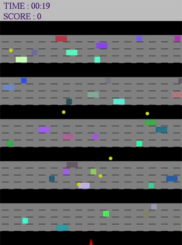

## Cross-Road-Game

Aim of the game is moving agent collecting points without crashing to vehicles.

#### Scoring
- Player gets *1 point* for each time you *jump*.
- Player gets *5 points* for each *coin* collected. 
	- It is not possible to jump backwards. Moving left/right is free.

#### End of the game
- The game is over if agent crashes with a vehicle.
	- To use sound effects, *.wav* files should be in the same directory of .sln file.

#### Dependencies
- Program should run in `win32` environment and needs `glut` and `opengl` libraries.

### Design choices:

**1.** For simplicity (when testing, to see winning info panel which appears after you won the game ), *if player resist 120 seconds without crash or reaches 200 points*, player wins the game.

**2.** In *one step mode* (when you click the right mouse), user may press as much as (s)he desires. And then, when right click is pressed again, last pressed keyboard key will be considered and agent will move according to this key.

**3.** Initially I generate vehicles every *100 miliseconds*, generate coins every *1000 miliseconds* and move vehicles every *20 miliseconds*.

**4.** When every 6th coin is generated, I dissappear the oldest one from the game.

### Extra features:

**1.** When game is over, player may restart game with pressing ***r***.

**2.** After game is over or game is won, *information panel* appears on the center of the screen.

**3.** When agent crashes with a vehicle, agent collects coin or game is over, I play sound effect. (Sometimes sound comes with delay, I could not figure that out)

**4.** There are three difficulty levels in the game which determined by pressing 1, 2 or 3 from keyboard. You may dynamically change difficulty by pressing them during the game without pause.

- ***easy (1):*** generate vehicles every *200ms* and generate coins every *2000ms* (if period of generating coins increases, older ones remain longer) 
- ***normal (2):*** [default] generate vehicles every 100ms and generate coins every 1000ms  
- ***hard (3):*** generate vehicles every 20ms and generate coins every 500ms  

#### Yaşar Can Kakdaş
